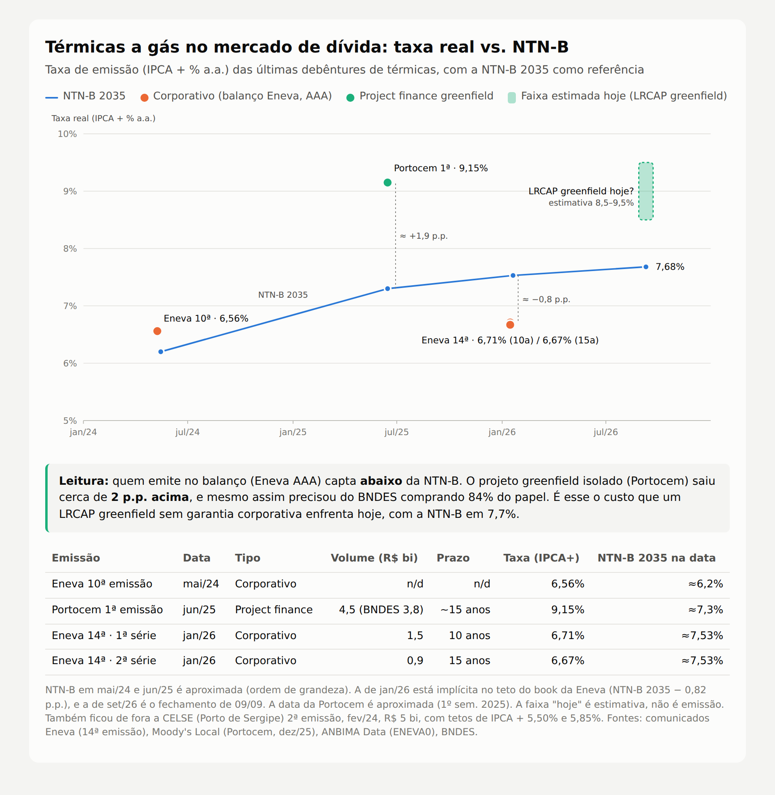

# LRCAP 2026 – Briefing para o painel (Bradesco BBI · Project Finance)

**15º Congresso Internacional do Direito da Energia · 24/09/2026**
Painel: *LRCAP 2026: A próxima fronteira para a geração termoelétrica e o gás natural*

> Legenda: **[fato]** = número público com fonte ao final · **[est.]** = estimativa/conta de padeiro nossa, para falar como ordem de grandeza e não como dado oficial.

---

## 0. Mensagens-chave (se só der tempo de falar 3 coisas)

1. **Dinheiro existe; o que falta é preço e prazo.** Em volume, o ciclo cabe no mercado (debêntures de infra + BNDES + bancos). Mas com NTN-B longa perto de **IPCA + 7,7%**, ninguém quer travar 15 anos de custo real nesse nível: a estrutura vai ser **ponte agora, *take-out* depois**.
2. **Foi um leilão de receita alta e pouca disputa, mas o ativo não é simples.** Deságio médio de **5,5%**, com produtos saindo praticamente no teto. Em contrapartida: penalidades pesadas, gás 100% flexível (algo que o Brasil nunca financiou em escala) e risco de infraestrutura fora da cerca da usina.
3. **O gargalo real é físico, não financeiro.** Se as ~15 GW a gás forem chamadas ao mesmo tempo, a demanda chega a **85–88 MMm³/d**, acima de todo o consumo firme não térmico do país hoje (**50–55 MMm³/d**). E o Brasil tem **zero** estocagem subterrânea em operação. Os EUA têm ~**133 bilhões de m³**.

---

## 1. Números de referência (cola)

### Leilão
| Item | Número |
|---|---|
| Data do 2º LRCAP (gás, carvão, UHE) | 18/03/2026 **[fato]** |
| Potência contratada | **18,98 GW** (100 empreendimentos) **[fato]** |
| Térmicas | ~16,7 GW, dos quais **~15,2 GW a gás** (90–92 usinas) **[fato]** |
| Ampliação de UHEs | ~2,5 GW **[fato]** |
| Novos vs. existentes | 8,9 GW novos (46,7%) · 7,6 GW existentes (40,1%) **[fato]** |
| Preço médio | **R$ 2,33 milhões/MW·ano** **[fato]** |
| Deságio médio | **5,52%**, frente a >120 GW cadastrados **[fato]** |
| Deságio por produto | 2026: 1,99% · 2027: R$ 5/MW (!) · 2030: 0,36% · 2031: 16,3% **[fato]** |
| Preços-teto | Térmica nova R$ 2,9 mi/MW·ano · existente R$ 2,25 mi · UHE R$ 1,4 mi **[fato]** |
| Prazo dos contratos | 15 anos (nova) · 10 anos (existente) **[fato]** |
| Investimento declarado | **R$ 64,5 bi** **[fato]** |
| Custo ao consumidor | > R$ 515 bi ao longo dos contratos (dado da homologação) **[fato]** |
| Maiores vencedores | Eneva (~4,4 GW), Petrobras e Âmbar (J&F): **~9 GW somados** **[fato]** |
| Homologação ANEEL | 21/05/2026, depois de ações judiciais e de a área técnica do TCU ter recomendado cautelar **[fato]** |

### Macro / funding
| Item | Número |
|---|---|
| Selic | **13,75%** (corte de 25 bps em 16/09; saiu de 15%) **[fato]** |
| NTN-B 2035 | **IPCA + 7,68%** (09/09/2026) **[fato]** |
| Debêntures incentivadas 2025 | **R$ 178 bi**, recorde histórico **[fato]** |
| Debêntures incentivadas 2026 | Jan–mai: R$ 58,9 bi (–5,8% a/a); jul: R$ 26,3 bi (–18% a/a). O mercado espera fechar 2026 **abaixo de 2025** (guerra no Irã + eleição) **[fato]** |
| Mercado de capitais total 2026 (jan–ago) | ~R$ 485 bi (+7,1% a/a). O crescimento vem de FIDC e crédito curto, não de infra longa **[fato]** |
| BNDES 1S26 | Aprovações R$ 110,6 bi (+52%), sendo **infra R$ 46 bi (+91%)**; desembolsos R$ 75,6 bi, sendo infra R$ 28,5 bi **[fato]** |

### Gás / infraestrutura
| Item | Brasil | EUA |
|---|---|---|
| Malha de transporte | **~9.400 km** (TAG ~4.500, TBG ~2.600, NTS ~2.000+) **[fato]** | **~480.000 km** (≈300 mil milhas de transmissão) **[fato]** → **~50x** |
| Território | 8,5 mi km² | 9,8 mi km² (dimensão parecida!) |
| Consumo total de gás | ~60–90 MMm³/d **[est.]** | ~2.500+ MMm³/d (~90 Bcf/d) **[est.]** → **~30–40x** |
| Queima para geração | pico térmico ~40 MMm³/d **[fato]** | **~1.240 MMm³/d** (43,7 Bcf/d, média do verão de 2025) **[fato]** |
| Estocagem subterrânea (gás útil) | **0 em operação**. 1º projeto: Origem/Pilar-AL, **50,6 MMm³** na fase 1 **[fato]** | **~4.683 Bcf ≈ 133 bilhões m³**, ~400 instalações **[fato]** → **~2.600x** |
| Regaseificação GNL | ~7 terminais, **~150 MMm³/d** nominais, todos FSRU e sem tanque em terra **[fato]** | n/a (exportador) |
| Hub/preço líquido | Não há (mercado concentrado) | Henry Hub + centenas de hubs regionais, mercado diário |

---

## 2. Pergunta 1: dimensão do ciclo e se há funding

> *"Qual é a dimensão desse ciclo de investimentos e existe capacidade de financiamento suficiente para viabilizá-lo nos prazos previstos?"*

### Roteiro de fala (~2–3 min)

**a) Dimensão.** "São R$ 64,5 bi só nas usinas. Somando o que vem por fora da cerca (novos terminais de GNL, reforço de gasoduto, conexões), o ciclo vai a algo como **R$ 80–100 bi** [est.]. Só a TBG já protocolou uma ampliação do Gasbol de US$ 290 mi, e as três transportadoras têm ~R$ 30 bi de capex previstos até 2033. O desembolso se concentra entre 2027 e 2030, porque a maioria das novas entra entre 2028 e 2031."

**b) Em volume, cabe.** "Com alavancagem de 60–70%, a dívida fica em **R$ 40–60 bi em 4 anos, ou seja, R$ 10–15 bi por ano** [est.]. O mercado de incentivadas fez R$ 178 bi em 2025 e o BNDES aprovou R$ 46 bi em infra só no primeiro semestre. Então volume não é o gargalo."

**c) O gargalo é preço, prazo e apetite, por três motivos:**
1. **Custo real no pico.** Com NTN-B 2035 a IPCA + 7,7%, a dívida longa sai algo como **IPCA + 7,5% a 8,5% all-in** [est.], o que dá **~12,5–13,5% nominal**. Nenhum sponsor quer travar 15 anos nesse nível sabendo que a Selic acabou de começar a cair (15% → 13,75%). O comportamento que vemos na mesa é **evitar travar taxa agora**: empréstimo-ponte / CCB em CDI de 2–3 anos durante a obra e emissão longa (incentivada, infra ou BNDES) quando o ativo estiver de-riscado e a curva tiver cedido.
2. **Mercado mais raso em 2026.** As incentivadas caem na comparação anual, com guerra no Irã e eleição travando o *pricing*. O mercado total cresce, mas por FIDC e crédito curto. Papel longo de *greenfield* sem histórico operacional é justamente o que o investidor de incentivada menos compra: ele prefere ativo operacional, TR (transmissão) e renovável com *track record*.
3. **Concentração.** Três grupos (Eneva, Petrobras, J&F) levaram ~9 GW. A Petrobras deve financiar pelo balanço. Para os outros, o limite de exposição por grupo econômico nos bancos passa a ser restrição real, e isso **empurra o funding para mercado de capitais, BNDES e ECAs** (turbinas importadas abrem espaço para crédito de agência de exportação).

**d) Prazos.** "O financiamento sai. O risco de prazo está no **equipamento** (fila global de turbinas a gás por causa de data center, com *slots* de OEM indo para 2029–2030) e na **infraestrutura de gás**. Não está no dinheiro."

**Frase de fechamento:** *"Liquidez tem. O que não tem é gente disposta a travar hoje 15 anos de IPCA + 8%. O desenho vai ser ponte curta na obra e mercado de capitais no operacional, e o *take-out* vai depender muito de como a curva se comportar depois da eleição."*

---

## 3. Pergunta 2: o que define a bancabilidade e como o financiador precifica

> *"Quais fatores serão mais determinantes para a bancabilidade e como o mercado deve refletir esses riscos nas estruturas?"*

### Contexto: um leilão de receita alta e pouco competitivo
- "Faz muito tempo que o setor elétrico não via um leilão sem **banho de sangue**. Foram 120 GW cadastrados, deságio médio de 5,5%, e o produto 2027 saiu com deságio de **R$ 5 por MW**. A lembrança mais próxima são os leilões de transmissão de meados da década passada: depois de rodadas com lotes vazios, a RAP foi recalibrada, pouca gente disputou, a Equatorial levou muita coisa com retorno alto e alguns lotes ficaram vazios."
- "Receita alta, porém, não é o mesmo que ativo simples. Com R$ 2,3–2,9 mi/MW·ano, a receita fixa paga o capex rápido. Só que essa receita precisa bancar também o **custo fixo de ter combustível disponível sem despachar** (capacidade de regas, transporte, *take-or-pay* do supridor). Uma parte grande do 'preço alto' é **seguro de combustível embutido**, não margem."

### Ranking dos riscos (do ponto de vista do credor)

| # | Risco | Por que pesa | Como aparece na estrutura |
|---|---|---|---|
| 1 | **Combustível flexível** | A inflexibilidade existiu no Brasil **justamente para viabilizar o suprimento**: o supridor precisa de *off-take* mínimo para precificar molécula, regas e transporte. Um gás 100% flexível desloca esse risco para o gerador, que precisa comprar opção de gás (capacidade reservada + *take-or-pay* baixo) sem saber quando vai despachar. | O credor vai querer **GSA/LNG SPA back-to-back** com o CRCAP: prazo, penalidade e *force majeure* casados, com LDs do supridor cobrindo as multas do contrato de potência. A dívida é dimensionada pela receita fixa **líquida** dos custos fixos de gás. |
| 2 | **Penalidades de disponibilidade** | Não atender a disponibilidade custa **10% da RF mensal + perda da parcela**. Não atender despacho do ONS, **15% + perda**. Indisponibilidade acima do TEIF/IP declarado, **+15%**. Parâmetro de flexibilidade estourado, **3% da RF por dia**. Uma única falha de combustível numa janela crítica pode consumir meses de caixa. | **Conta reserva de penalidades** além da reserva de serviço da dívida, DSCR mais alto que o de transmissão, *sculpting* conservador e *cash sweep*. Covenants de disponibilidade. |
| 3 | **Implantação: equipamento, EPC, conexão** | Fila de turbinas, EPC com poucos *players* e conexão elétrica. Atraso vira penalidade e pode levar à rescisão. | **Garantia corporativa do sponsor até o COD** (*completion*), EPC *lump-sum turnkey* com LDs, *slot* de turbina firmado **antes** do *financial close*. Sem *slot*, sem dívida longa. |
| 4 | **Infraestrutura fora da cerca** | A usina depende de terminal, gasoduto ou ampliação de terceiros (ex.: Gasbol com COD em out/2029) que não estão sob controle do projeto. | Mecanismo de *interface risk* (quem paga se o gasoduto atrasar?), *step-in* e condição precedente de contratação de capacidade firme de transporte/regas. |
| 5 | **Regulatório/jurídico** | TCU, ações judiciais, questionamentos sobre preço-teto e custo de R$ 515 bi ao consumidor. Contrato de 15 anos atravessa três ou quatro governos. | *Legal opinions* robustas, cláusula de *change in law*, e o risco de revisão contratual vira **spread**. |
| 6 | **Licenciamento** | Menor para o gerador (sites *brownfield* e portos), maior para terminais e dutos novos. | CP de LI/LO para desembolsos. |

**Frase de fechamento:** *"No LRCAP o credor não financia uma usina, financia a garantia de molécula na hora certa. A bancabilidade vai ser decidida no contrato de gás, não no de potência."*

---

## 4. A pergunta que ninguém quer responder: tem gás e infraestrutura para todo mundo ao mesmo tempo?

### Cenário de estresse: as ~15 GW chamadas na mesma janela
- Consumo de uma térmica a gás a plena carga: ~**4,5–5 MMm³/d por GW** em ciclo combinado e ~**6–6,5 MMm³/d por GW** em ciclo aberto ou motores [est.].
- **15 GW → 70–95 MMm³/d.** O número público converge: **85–88 MMm³/d** de demanda potencial das novas térmicas, contra **50–55 MMm³/d** de demanda firme hoje e um pico térmico atual de ~40 MMm³/d [fato].
- **A conta do navio.** Um navio de 170 mil m³ de GNL vira ~**100 MMm³ de gás** [est.]. Com o parque inteiro despachado, é **quase um navio por dia**. Da Costa do Golfo americana ao Brasil são ~2–3 semanas de viagem, então a logística tem que ser armada **antes** do despacho, e o ONS avisa com horas ou dias de antecedência.

### GNL: é o candidato óbvio, mas a folga é menor do que parece
- O GNL é a fonte mais "despachável" (não depende de produção associada ao pré-sal), por isso a maioria dos vencedores está perto de terminal, porto e malha: **gas-to-wire** [fato].
- Capacidade nominal de ~150 MMm³/d, **mas boa parte está ancorada em térmicas-base** dos próprios terminais (ex.: Sergipe tem 21 MMm³/d de regas e a CELSE consome ~6 MMm³/d; Açu/GNA, Pecém e Barcarena seguem a mesma lógica). **Para o LRCAP sobra só o excedente**, o que a térmica-âncora não consome, e ainda disputado com a Petrobras e com o mercado livre.
- **FSRU não é estocagem.** Os FSRUs têm 138–170 mil m³ de GNL, que dão **poucos dias** de regaseificação a plena carga. Sem tanque em terra e sem estocagem subterrânea, cada terminal é um **pulmão de dias**, não de semanas.
- **Hipótese de trabalho para o painel:** atender **~20% do parque (~3 GW ≈ 15–20 MMm³/d)** via GNL em despacho simultâneo já exige, na prática, **o excedente de um FSRU inteiro mais um navio a cada 5–7 dias** [est.]. Ir muito além disso depende dos **novos terminais que o próprio leilão ancorou** (pelo menos dois) e de a ANP destravar o **acesso de terceiros** aos terminais existentes.
- Lembrar ainda que o **transporte** é limitado. TAG, por exemplo, anunciou ~22 MMm³/d de capacidade disponível para terceiros na sua malha, e a ampliação do Gasbol só entra em out/2029.

**Frase:** *"Cada usina fechou seu contrato de gás olhando para si mesma. Ninguém contratou pensando no dia em que todas forem chamadas juntas, e é exatamente para esse dia que o leilão foi feito."*

---

## 5. Estocagem: regulação no Brasil vs. EUA

### Brasil
- A **Lei do Gás (14.134/2021)** tornou a estocagem subterrânea uma atividade sob **autorização** da ANP, sem concessão, o que já é um avanço.
- Ainda **não há regulação infralegal consolidada**. A ANP trabalha com minuta, e a redação do **art. 13, §1º do Decreto 10.712/2021** gera dúvida sobre a livre negociação da remuneração, que é justamente o que o investidor precisa para montar o *business case* [fato].
- Primeira autorização: **Origem Energia, Pilar-AL**, reservatório depletado com **50,6 MMm³** úteis na fase 1 (minuta aprovada em dez/2025, operação prevista para o fim de 2026). A Petrobras estuda converter **Manati-BA** e já declarou publicamente que o LRCAP **exige estocagem subterrânea** [fato].
- **Escala:** os 50,6 MMm³ de Pilar equivalem a **~14 horas** de despacho total das térmicas do LRCAP [est.].

### EUA: o que dá liquidez ao sistema deles
- **~400 instalações, ~133 bilhões m³ de gás útil**, o suficiente para cobrir **~50 dias do consumo total** do país [est. a partir de dados EIA].
- **Regulação:** a FERC certifica a estocagem interestadual (Natural Gas Act). Desde a **Order 636 (1992)** o transporte e a estocagem são *unbundled*, ou seja, separados da venda da molécula, com *open access*. O **Energy Policy Act de 2005** permitiu **tarifa a mercado (*market-based rates*)** para nova estocagem mesmo sem demonstrar ausência de poder de mercado, e foi isso que destravou o investimento privado *merchant*.
- **Outros amortecedores que o Brasil não tem:**
  - **~480 mil km de malha** de transmissão contra ~9,4 mil km aqui, em territórios de tamanho parecido.
  - **Parque *merchant*** despachando por preço num mercado spot líquido, com hubs diários, *capacity release* e serviço *no-notice* dos gasodutos.
  - **Consumidores interruptíveis / última instância:** as distribuidoras (LDCs) e os gasodutos têm contratos **interruptíveis** com indústria e usinas *dual-fuel*. No aperto, corta-se o interruptível e o gás vai para quem é firme. No Brasil quase todo contrato é firme, e não existe esse "colchão" de demanda cortável.
- **Mesmo assim, não é à prova de falha.** A tempestade **Uri (Texas, 2021)** e a **Elliott (dez/2022)** mostraram gás e elétrico falhando **ao mesmo tempo**, com a própria produção de gás congelando. A lição é que a coordenação gás–eletricidade é o elo fraco até no sistema mais líquido do mundo.

**Frase:** *"Os EUA têm 50 vezes mais duto, milhares de vezes mais estocagem e um mercado de interruptíveis, e mesmo assim tiveram Uri e Elliott. Nós contratamos 15 GW de flexibilidade em cima de um sistema de gás sem pulmão."*

---

## 6. Pergunta reserva: infraestrutura compartilhada e receitas adicionais

> *"Compartilhamento e diversificação de receitas melhoram a financiabilidade? Que condições regulatórias e contratuais são necessárias?"*

- **Melhoram, mas o credor só dá crédito ao que é contratado.** Terminal ou duto ancorado pela receita fixa do LRCAP vira um ativo com **âncora de crédito**. A capacidade excedente vendida a terceiros (indústria, distribuidora, outras térmicas) é *upside* e, no melhor caso, entra no caso-base como **receita contratada firme com contraparte avaliada**. Merchant puro entra com *haircut* ou fica só no *equity case*.
- **Condições para o financiador reconhecer esse valor:**
  1. **Regras claras de acesso de terceiros** a terminais de GNL (ANP), com prioridade da âncora preservada. Sem isso o credor enxerga risco de a âncora perder capacidade.
  2. **Contratos de capacidade firmes e de longo prazo** com terceiros, não só *spot*.
  3. **Tarifa/remuneração previsível**, com metodologia estável de revisão tarifária nos dutos e liberdade de preço na estocagem e no terminal.
  4. **Segregação societária e de fluxos** (SPE do terminal separada da SPE da térmica, ou ao menos *waterfall* e garantias separadas), para evitar contaminação de risco.
  5. **Integração com planejamento** (PNIIGás / plano coordenado de gasodutos), para que o duto não seja construído só para uma térmica que despacha 10% do tempo.
- **Ponto de atenção:** existe tensão entre **priorizar a térmica** (que precisa do gás na hora crítica) e **vender excedente** (que pode não estar disponível exatamente nessa hora). O contrato tem que dizer quem é cortado primeiro.

---

## 7. Rodada final: uma medida prioritária

Opção principal:
> **"Leiloar o combustível junto com a potência: exigir e reconhecer contratualmente a cadeia firme de gás (molécula, regas, transporte e, quando houver, estocagem) como parte do produto, com penalidades casadas ponta a ponta. O maior risco para o sistema e para o credor está no gás, não na usina."**

Alternativas curtas:
- "Calendário previsível de leilões de capacidade com metodologia de preço-teto pública e estável. Previsibilidade vale mais que preço alto."
- "Regulação de estocagem subterrânea e de acesso a terminais concluída antes do próximo LRCAP."

---

## 8. Perguntas difíceis que podem vir da plateia

**"O consumidor vai pagar R$ 515 bi por um leilão sem competição. O banco não está financiando um problema?"**
Estamos financiando um contrato homologado pela ANEEL, com prazo e receita definidos. O preço de um leilão é uma discussão de política pública. O que cabe ao financiador é que a regra do jogo seja estável: se o contrato for revisto *ex post*, o custo de capital de **todo** o setor sobe, não só o dessas usinas.

**"Com juros caindo, por que não travar já?"**
É justamente por estarem caindo. Quem trava hoje paga o topo da curva. A decisão racional é ponte e *take-out*. O risco dessa estratégia é a curva não ceder (fiscal, eleição), por isso o *hedge* parcial e janelas oportunistas de emissão.

**"Baterias vão tornar essas térmicas stranded?"**
São produtos diferentes: bateria entrega potência de horas, térmica entrega potência de dias e semanas (seca prolongada, vale de renovável de vários dias). Complementam-se. O que pode mudar é o preço-teto dos próximos LRCAPs térmicos.

---

## 9. Emissões recentes de térmicas: o que o mercado cobra

| Emissão | Data | Tipo | Volume | Taxa |
|---|---|---|---|---|
| Eneva 10ª | mai/24 | Corporativo | n/d | IPCA + 6,56% |
| Portocem 1ª | 1S25 | Project finance greenfield (BNDES comprou R$ 3,8 bi de R$ 4,5 bi) | R$ 4,5 bi | **IPCA + 9,15%** |
| Eneva 14ª (Azulão II), 10 anos | jan/26 | Corporativo AAA | R$ 1,5 bi | IPCA + 6,71% |
| Eneva 14ª (Azulão II), 15 anos | jan/26 | Corporativo AAA | R$ 0,9 bi | IPCA + 6,67% |

**Mensagem:** o crédito corporativo AAA capta **abaixo** da NTN-B (~ −0,8 p.p.). Um projeto isolado saiu **~2 p.p. acima**, e mesmo assim com o BNDES como âncora. Com a NTN-B em 7,7%, um LRCAP greenfield sem garantia corporativa custaria hoje algo como **IPCA + 8,5% a 9,5%** [est.]. É por isso que ninguém quer travar agora, e que os grandes (Eneva, Petrobras, J&F) tendem a financiar no balanço corporativo.

---

## 10. TCU e contratos: onde isso parou

| Data | Evento |
|---|---|
| 18/03 | Leilão (18,98 GW) |
| mar–mai | Ações judiciais em vários estados; área técnica do TCU recomenda suspender as térmicas; MPF pressiona |
| 21/05 | ANEEL homologa os produtos 2026 (13 usinas) após a Justiça negar suspensão |
| mai | Comissão de Leilões inabilita **9 usinas da EPP/ION (J&F), ~1,7 GW** (2028–29) + UTE Garuva (88 MW) |
| 09–11/06 | ANEEL homologa o restante: **95 usinas / 17,4 GW** (2º LRCAP ~90% homologado; 3º LRCAP 100%) |
| **17/06** | **TCU, por unanimidade, mantém o LRCAP** (relator Jorge Oliveira). Reconhece "falhas relevantes na modelagem, no preço-teto e possivelmente no volume, sobretudo nas térmicas", mas **rejeita suspender** e **rejeita mandar os autos à PF e ao Cade**. Em troca, determina que a AudElétrica investigue **"geradoras de papel"** (capacidade econômico-financeira real dos vencedores) e autoriza inspeções em MME, ANEEL, EPE e ONS |
| 22/07 | CMSE antecipa para **01/09** quatro térmicas do LRCAP (Termomacaé 818 MW, Três Lagoas 235 MW, Termoceará 175 MW, da Petrobras; Araucária 452 MW, da Âmbar), por causa do risco de El Niño |
| 01/09 | ANEEL nega pedido da J&F para suspender prazos de garantia de acesso das usinas EPP (exposição de ~R$ 600 mi) |
| set | Recurso da EPP negado na Comissão; ficam na fila para convocação **Eneva (2 usinas, 790 MW)** e **Global (2 usinas, 555 MW)**; MME outorga 12 térmicas (16/09) |

**Condição para assinar o CRCAP:** termo de compromisso com a transportadora de gás. A ATGás apontou **defasagem de 4,8 MMm³/d** entre o volume informado por ANEEL/EPE e os termos assinados. Além disso, o MME flexibilizou a exigência de capacidade firme de transporte para **70%** da operação a plena carga, e não 100%.

**Leitura para o painel:** o risco "leilão cair" praticamente acabou. O risco que sobra é de **execução e contraparte**: o TCU mirando "geradoras de papel", inabilitações por garantia e conexão, e contratos de gás/transporte abaixo do necessário. É exatamente o que o credor vai diligenciar.

---

## 11. Gás flexível a ~US$ 3/MMBtu: é viável?

**A lógica econômica.** Quem vende gás flexível vende uma **opção**: reserva molécula, regas e transporte o ano todo e pode entregar quase nada. Esse custo fixo precisa ser pago por um prêmio de reserva (capacidade), cobrado com ou sem despacho. A inflexibilidade existia justamente para diluir esse custo no volume.

**US$ 3/MMBtu como prêmio de flexibilidade (sobre o volume contratado, pago sempre): [est.]**
- 1 GW de ciclo combinado a plena carga consome ~4,5–5 MMm³/d, ou seja, ~**160–180 mil MMBtu/d**.
- US$ 3 × ~170 mil MMBtu × 365 ≈ **US$ 185 mi/ano por GW ≈ R$ 1,0 bi/ano por GW** (câmbio ~5,5).
- A receita fixa é de R$ 2,3–2,9 bi/ano por GW. Logo, **~35–45% da RF iria só para a opção de gás**, antes de O&M e serviço da dívida. Cabe, mas aperta o DSCR. O número faz sentido como prêmio **se for cobrado sobre ~70% da capacidade**, que é o piso de transporte firme exigido. Se a ideia for **US$ 3 de molécula** (commodity), é **inviável** com qualquer fonte hoje.

**E com gás da Bolívia ou da Argentina?**
| | Bolívia | Argentina (Vaca Muerta) |
|---|---|---|
| Situação | Produção em declínio; YPFB projeta **–30% de exportação em 2026** e fim da capacidade exportadora por volta de **2030** (2034 no melhor caso). Em 2024 foram só ~14 MMm³/d via Gasbol | Produção recorde, mas o país **ainda importa GNL no inverno** (20–24 cargas em 2026, ~US$ 1,4 bi) e **corta indústria** nos picos de frio |
| Custo até a fronteira | n/a (o gás acabou) | **US$ 4–5/MMBtu** na fronteira, com trânsito boliviano de **US$ 1,4–2,0/MMBtu** (firme, sazonal ou interruptível) |
| Volume | Contrato com a Petrobras de até 20 MMm³/d, já flexibilizado | ~2 MMm³/d no curto prazo; ~30 MMm³/d só lá por **2030**, com investimento do lado argentino |
| Problema de flexibilidade | Sem reserva para servir de "pulmão" | **Descasamento sazonal:** o despacho térmico no Brasil pesa mais na seca (mai–nov), que coincide com o **inverno argentino**, justamente quando o gás argentino some |

**Conclusão:** nem Bolívia nem Argentina conseguem **sozinhas** vender flexibilidade firme e barata. A Bolívia é hoje um **corredor** (trânsito), não mais uma fonte. A Argentina tem molécula, mas na janela errada do ano. Uma flexibilidade crível sai de um **portfólio**: molécula argentina/doméstica na base, **GNL spot como opção de pico**, uso da **linepack** do Gasbol ociosa (capacidade de 30 MMm³/d, transportando 18–20) e, no médio prazo, **estocagem subterrânea**. Quem pode montar esse portfólio são os integrados (Petrobras, Eneva, J&F com termos com Tecpetrol, PAE e YPFB). Supridor independente de gás 100% flexível a US$ 3 me parece **otimista**, salvo se o preço for só o prêmio de reserva e a molécula for cobrada à parte, indexada a Henry Hub/Brent/JKM quando despachar.

---

## 12. Fatos para reconfirmar antes do painel
- Situação atual do processo no TCU e da assinatura dos CRCAPs (a homologação foi em 21/05, mas havia ações correndo).
- Última taxa da NTN-B e dado mais recente de incentivadas (boletim ANBIMA de agosto, publicado em setembro).
- Lista exata de terminais de GNL em operação e capacidade de cada um (fontes divergem entre 5 e 8 terminais).
- A analogia com os leilões de LT: os leilões de 2014–2015 tiveram muitos lotes vazios, e a varredura da Equatorial com RAP recalibrada foi mais marcada nos certames de **2016–2017**. Vale ajustar as datas na fala ("meados da década passada") para não ser corrigido pela plateia.

---

## Fontes
- ANEEL – [Leilão de Reserva de Capacidade contrata 18,97 GW](https://www.gov.br/aneel/pt-br/assuntos/noticias/2026/leilao-de-reserva-de-capacidade-contrata-18-97-gw)
- Agência Brasil – [Leilão contrata 19 mil MW](https://agenciabrasil.ebc.com.br/economia/noticia/2026-03/leilao-contrata-19-mil-mw-em-leilao-historico-para-reserva-energetica)
- CNN Brasil – [Leilão contrata 19 GW e movimenta R$ 64,5 bi](https://www.cnnbrasil.com.br/infra/leilao-contrata-19-gw-de-termicas-e-hidreletricas-e-movimenta-r-645-bi/)
- eixos – [Muita potência e baixa competição](https://eixos.com.br/newsletters/comece-seu-dia/muita-potencia-e-baixa-competicao-o-resultado-do-leilao-de-energia-mais-esperado-de-2026/)
- Canal Solar – [Disputa produto a produto do LRCAP 2026](https://canalsolar.com.br/primeiro-produto-lrcap-desagio-297/)
- eixos – [Preços-teto do LRCAP](https://eixos.com.br/energia-eletrica/precos-teto-do-lrcap-tensionam-leilao-desenhado-para-pacificar-conflitos/)
- Agência iNFRA – [Eneva, Petrobras e Âmbar despontam como principais vencedoras](https://agenciainfra.com/blog/lrcap-eneva-petrobras-e-ambar-despontam-como-principais-vencedoras/)
- eixos – [Raio-x: LRCAP ancora terminais de GNL e reafirma gas-to-wire](https://eixos.com.br/newsletters/newsletter-gas-week/raio-x-do-lrcap-leilao-ancora-novos-terminais-de-gnl-e-reafirma-gas-to-wire/)
- eixos – [A corrida por investimentos na infraestrutura de gás](https://eixos.com.br/newsletters/newsletter-gas-week/a-corrida-por-investimentos-na-infraestrutura-de-gas-para-abastecer-as-termicas-do-lrcap/)
- Cenário Energia – [TBG projeta demanda extra de 14 MMm³/d](https://cenarioenergia.com.br/2026/03/20/lrcap-2026-tbg-projeta-demanda-extra-de-14-milhoes-de-m%C2%B3-dia-de-gas-com-novas-termicas/)
- eixos – [Petrobras vê necessidade de estocagem subterrânea](https://eixos.com.br/gas-natural/mercado-de-gas/petrobras-ve-necessidade-de-estocagem-subterranea-de-gas-para-atender-termicas-flexiveis-do-lrcap)
- eixos – [LRCAP 2026 e o desafio da flexibilidade](https://eixos.com.br/energia-eletrica/lrcap-2026-e-o-desafio-da-flexibilidade-no-sistema-eletrico-brasileiro/)
- Brasil Energia – [Geradores alertam para rigor nas multas do LRCAP](https://brasilenergia.com.br/brasilenergia/termeletricas-e-seguranca-energetica/geradores-alertam-para-rigor-excessivo-nas-multas-do-lrcap)
- Cescon Barrieu – [LRCAP 2026: resultados, controvérsias e TCU](https://cesconbarrieu.com.br/lrcap-2026-resultados-controversias-e-analise-pelo-tcu/)
- CNN Brasil – [Aneel homologa leilão de capacidade](https://www.cnnbrasil.com.br/infra/aneel-homologa-leilao-de-capacidade-apos-justica-negar-suspensao-do-certame/)
- ANBIMA – [Mercado de capitais registra R$ 48,8 bi em agosto](https://www.anbima.com.br/pt_br/noticias/mercado-de-capitais-registra-r-48-8-bilhoes-em-ofertas-em-agosto.htm)
- NeoFeed – [O que está desincentivando as debêntures incentivadas](https://neofeed.com.br/negocios/o-que-esta-desincentivando-as-emissoes-de-debentures-incentivadas/)
- Safra – [Crédito privado: emissões de julho/2026](https://oespecialista.safra.com.br/credito-privado-emissoes-julho-2026/)
- BNDES / Diário do Comércio – [Desembolsos do 1º semestre de 2026](https://diariodocomercio.com.br/financas/bndes-maior-desembolso-credito-governo-dilma/)
- Clube FII – [Copom reduz Selic para 13,75%](https://www.clubefiinews.com.br/mercado/copom-reduz-selic-para-1375-ao-ano-em-setembro)
- Mais Retorno – [NTN-B 2035](https://maisretorno.com/titulos-publicos/ntn-b-15-05-2035-brstncntb0o7)
- TAG – [Sobre a TAG](https://ntag.com.br/en/about-tag/) · eixos – [TAG tem 22 MMm³/d para terceiros](https://eixos.com.br/politica/tag-tem-capacidade-de-transporte-para-ate-22-milhoes-de-m%C2%B3-dia-alem-da-petrobras/)
- EPE – [Terminais de regaseificação de GNL nos portos brasileiros](https://www.epe.gov.br/pt/publicacoes-dados-abertos/publicacoes/informe-tecnico-terminais-de-regaseificacao-de-gnl-nos-portos-brasileiros-panorama-dos-principais-projetos-e-estudos) · GasNet – [Brasil chega a oito terminais de GNL](https://gasnet.com.br/Conteudo/22910/Brasil-chega-a-oito-terminais-de-GNL)
- Mattos Filho – [Boletim O&G ago/2026](https://www.mattosfilho.com.br/unico/boletim-oeg-agosto-2026/) (autorização de estocagem da Origem)
- EIA – [US natural gas storage capacity increased slightly in 2025](https://www.eia.gov/todayinenergy/detail.php?id=67745)
- EIA – [Natural gas for power generation flat this summer](https://www.eia.gov/todayinenergy/detail.php?id=67725)
- Congress.gov (CRS) – [Interstate Natural Gas Pipeline Siting](https://www.congress.gov/crs-product/R45239)

### Fontes adicionais (seções 9–11)
- Cenário Energia – [Eneva capta R$ 2,4 bi (14ª emissão)](https://cenarioenergia.com.br/2026/02/10/eneva-capta-r-24-bilhoes-em-debentures-e-reforca-posicao-financeira-com-emissao-avaliada-em-aaabra/)
- Moody's Local – [Relatório de crédito Portocem (dez/2025)](https://moodyslocal.com.br/wp-content/uploads/2025/12/MLBR_RelatoriodeCredito_Portocem_12.2025vf.pdf) · BNDES – [Apoio à Portocem](https://agenciadenoticias.bndes.gov.br/infraestrutura/Com-R$-38-bi-BNDES-apoia-construcao-de-termeletrica-a-gas-natural-da-Portocem/)
- ANBIMA Data – [ENEVA0](https://data.anbima.com.br/debentures/ENEVA0/caracteristicas)
- Cenário Energia – [TCU mantém LRCAP por unanimidade](https://cenarioenergia.com.br/2026/06/17/por-unanimidade-tcu-mantem-lrcap-2026-e-afasta-envio-de-autos-a-pf/) · eixos – [TCU aperta cerco a "geradores de papel"](https://eixos.com.br/energia-eletrica/tcu-nega-pedido-para-suspender-lrcap-mas-aperta-o-cerco-contra-geradores-de-papel/) · Agência iNFRA – [Plenário decide investigar geradoras de papel](https://agenciainfra.com/blog/plenario-do-tcu-decide-investigar-geradoras-de-papel-no-lrcap/)
- eixos – [Com homologação, novela do LRCAP fica mais próxima do fim](https://eixos.com.br/newsletters/comece-seu-dia/com-homologacao-de-contratos-novela-do-lrcap-fica-mais-proxima-do-fim) · Cenário Energia – [ANEEL exclui 1,7 GW da EPP](https://cenarioenergia.com.br/2026/05/29/aneel-exclui-17-gw-da-epp-do-lrcap-e-reacende-alerta-sobre-seguranca-de-potencia-no-sin/) · Agência iNFRA – [Recurso da EPP negado; Eneva e Global podem ser convocadas](https://agenciainfra.com/blog/lrcap-comissao-nega-recurso-da-epp-eneva-e-global-podem-ser-convocadas/) · LawInfra – [ANEEL nega cautelar da J&F](https://www.lawinfra.com.br/noticias/aneel-nega-cautelar-jf-lrcap-prazo-garantias-2026)
- ePowerBay – [CMSE antecipa térmicas do LRCAP](https://www.epowerbay.com/single-post/governo-aciona-vencedores-do-lrcap-2026-para-antecipar-geracao) · Cenário Energia – [MME outorga 12 térmicas](https://cenarioenergia.com.br/2026/09/16/mme-outorga-12-termeletricas-vencedoras-do-lrcap-com-operacao-prevista-ate-2031/)
- Agência iNFRA – [Transportadoras apontam defasagem de gás](https://agenciainfra.com/blog/lrcap-transportadoras-apontam-defasagem-de-gas-para-termicas-contratadas/)
- eixos – [Bolívia define preço de trânsito do gás argentino](https://eixos.com.br/gas-natural/mercado-de-gas/bolivia-define-preco-para-enviar-gas-argentino-ao-brasil/) · eixos – [Bolívia projeta –30% de exportação em 2026](https://eixos.com.br/gas-natural/mercado-de-gas/bolivia-projeta-reducao-de-30-nas-exportacoes-de-gas-natural-em-2026/) · Times Brasil – [Vaca Muerta via Bolívia e Gasbol](https://timesbrasil.com.br/empresas-e-negocios/infraestrutura/exclusivo-gas-produzido-em-vaca-muerta-na-argentina-pode-chegar-ao-brasil-via-bolivia-e-gasbol-diz-vice-presidente-da-tecpetrol-daniel-valencio/) · Infobae – [Importação de GNL no inverno argentino 2026](https://www.infobae.com/economia/2026/04/17/la-importacion-de-gnl-para-el-invierno-podria-costar-usd-1400-millones-por-el-salto-internacional-de-precios/)
